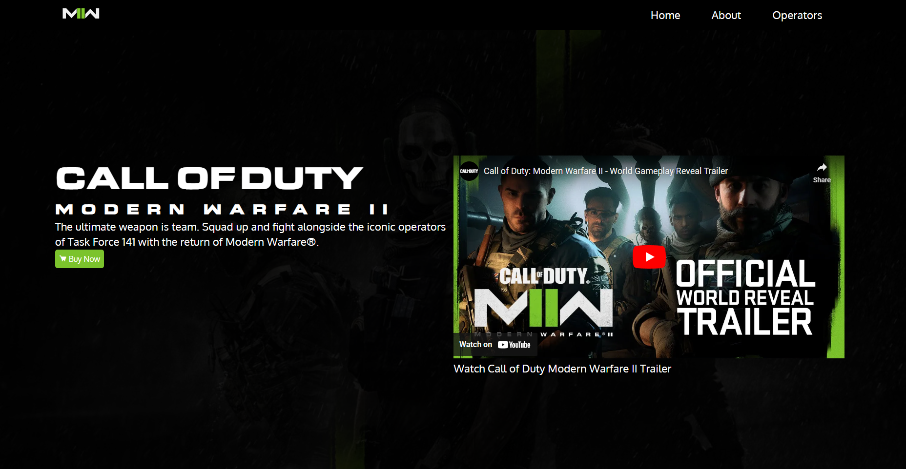
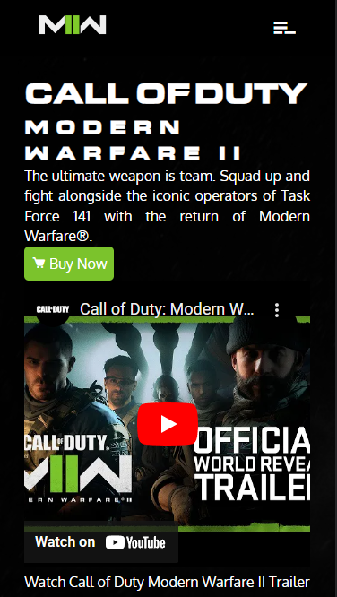

# Call of Duty Modern Warfare II Web Design
<table>
  <tr>
    <td valign="top"></td>
    <td valign="top"></td>
  </tr>
</table>

## About

I'm a casual gamer, Call of Duty is one of the game I play when my brain is tired from programming tasks and Capture the Flag challenges from tryhackme.com. 

I designed and developed this simple web page before the release of the COD MW II.

This is also my way to practice my skills in scss and responsive design without depending on frameworks like bootstrap, tailwind and etc.